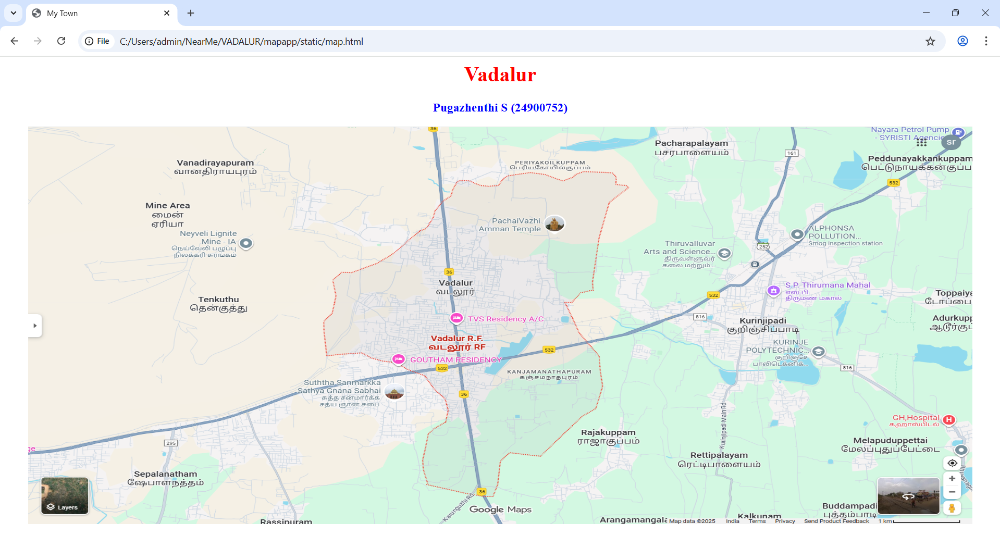
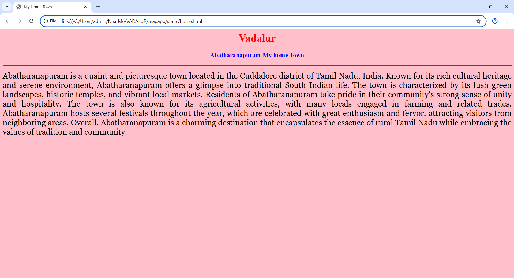
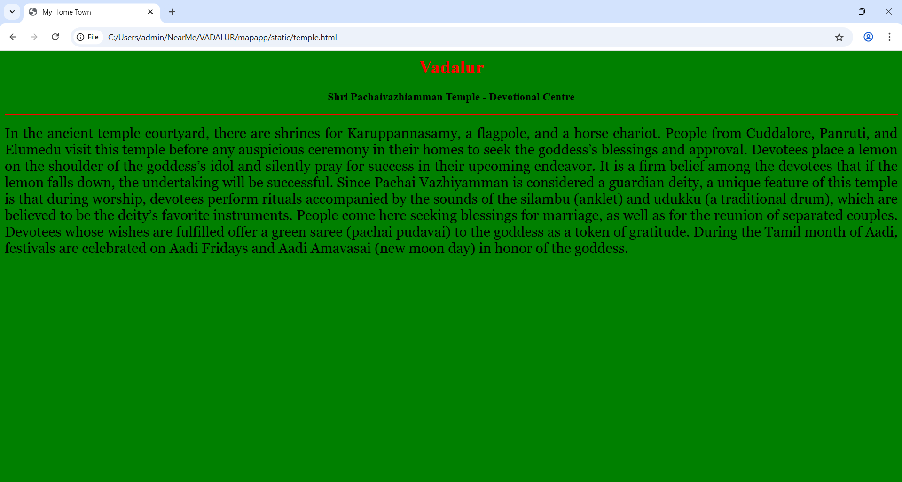
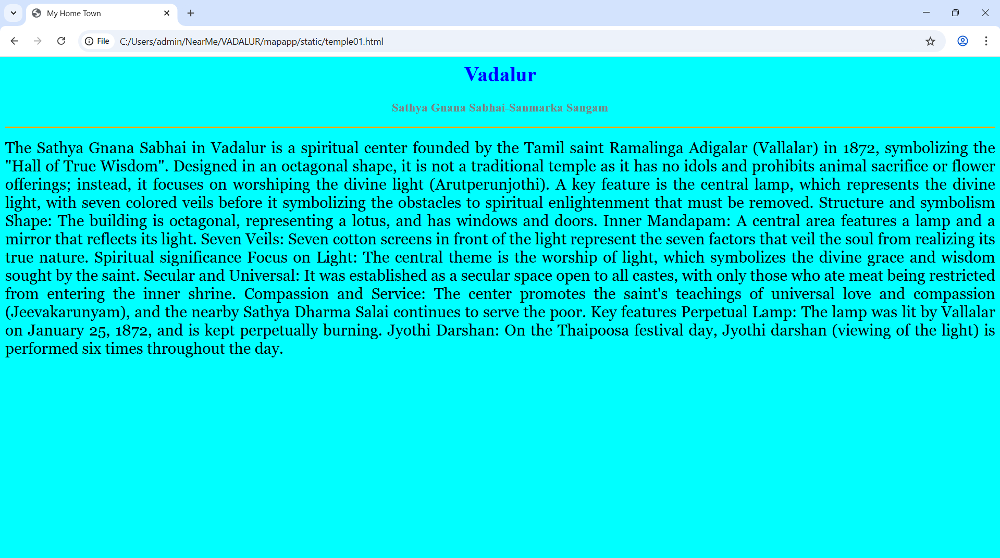
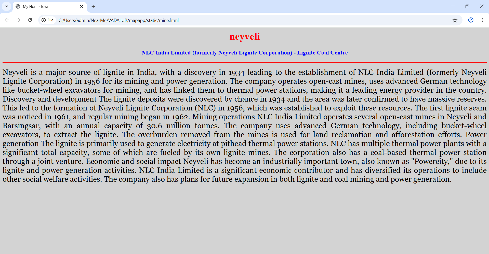
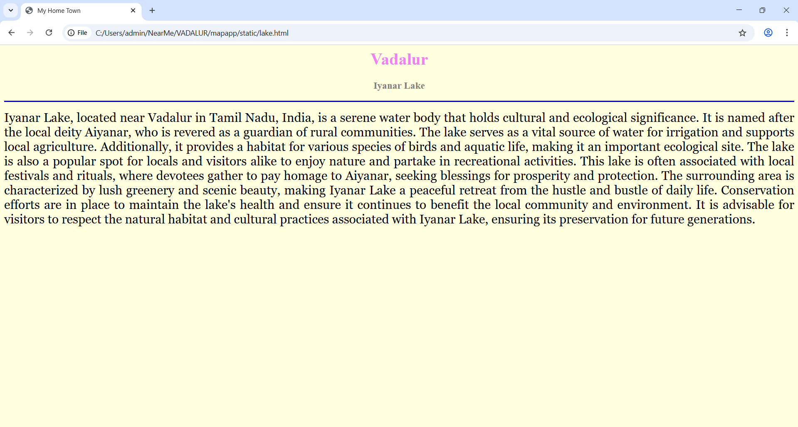

# Ex04 Places Around Me
## Date: 09.11.2025

## AIM
To develop a website to display details about the places around my house.

## DESIGN STEPS

### STEP 1
Create a Django admin interface.

### STEP 2
Download your city map from Google.

### STEP 3
Using ```<map>``` tag name the map.

### STEP 4
Create clickable regions in the image using ```<area>``` tag.

### STEP 5
Write HTML programs for all the regions identified.

### STEP 6
Execute the programs and publish them.

## CODE
```
map.html

<html>
<head>
    <title>My Town</title>
</head>
<body>
    <h1 align="center">
        <font color="red"><b>Vadalur</b></font>
    </h1>
    <h3 align="center">
        <font color="blue"><b>Pugazhenthi S (24900752)</b></font>
    </h3>
    <center>
        
        <map name="MyCity">
            <area shape="rect" coords="858,328,985,432" href="home.html" title="My Home Town">
            <area shape="circle" coords="1061,246,44" href="temple.html" title="Pachavazhiamman Temple">
            <area shape="circle" coords="741,686,72" href="temple01.html" title="Sathya Gnana Sabhai">
            <area shape="circle" coords="435,297,121" href="mine.html" title="Neyveli Lignite Mine">
            <area shape="rect" coords="1014,531,945,642" href="lake.html" title="Iyanar Lake">
        </map>
    </center>
</body>
</html>


home.html

<html>
<head>
    <title>My Home Town</title>
</head>
<body bgcolor="pink">
    <h1 align="center">
        <font color="red"><b>Vadalur</b></font>
    </h1>
    <h3 align="center">
        <font color="blue"><b>Abatharanapuram-My home Town</b></font>
    </h3>
    <hr size="3" color="red">
    <p align="justify">
        <font face="Georgia" size="5">
            Abatharanapuram is a quaint and picturesque town located in the Cuddalore district of Tamil Nadu, India. Known for its rich cultural heritage and serene environment, Abatharanapuram offers a glimpse into traditional South Indian life. The town is characterized by its lush green landscapes, historic temples, and vibrant local markets. Residents of Abatharanapuram take pride in their community's strong sense of unity and hospitality. The town is also known for its agricultural activities, with many locals engaged in farming and related trades. Abatharanapuram hosts several festivals throughout the year, which are celebrated with great enthusiasm and fervor, attracting visitors from neighboring areas. Overall, Abatharanapuram is a charming destination that encapsulates the essence of rural Tamil Nadu while embracing the values of tradition and community.
        </font>
    </p>
</body>
</html>


temple.html

<html>
<head>
    <title>My Home Town</title>
</head>
<body bgcolor="green">
    <h1 align="center">
        <font color="red"><b>Vadalur</b></font>
    </h1>
    <h3 align="center">
        <font color="black"><b>Shri Pachaivazhiamman Temple - Devotional Centre</b></font>
    </h3>
    <hr size="3" color="red">
    <p align="justify">
        <font face="Georgia" size="5">
            In the ancient temple courtyard, there are shrines for Karuppannasamy, a flagpole, and a horse chariot. People from Cuddalore, Panruti, and Elumedu visit this temple before any auspicious ceremony in their homes to seek the goddess’s blessings and approval. Devotees place a lemon on the shoulder of the goddess’s idol and silently pray for success in their upcoming endeavor. It is a firm belief among the devotees that if the lemon falls down, the undertaking will be successful.

Since Pachai Vazhiyamman is considered a guardian deity, a unique feature of this temple is that during worship, devotees perform rituals accompanied by the sounds of the silambu (anklet) and udukku (a traditional drum), which are believed to be the deity’s favorite instruments. People come here seeking blessings for marriage, as well as for the reunion of separated couples. Devotees whose wishes are fulfilled offer a green saree (pachai pudavai) to the goddess as a token of gratitude. During the Tamil month of Aadi, festivals are celebrated on Aadi Fridays and Aadi Amavasai (new moon day) in honor of the goddess.
        </font>
    </p>
</body>
</html>


temple01.html

<html>
<head>
    <title>My Home Town</title>
</head>
<body bgcolor="cyan">
    <h1 align="center">
        <font color="blue"><b>Vadalur</b></font>
    </h1>
    <h3 align="center">
        <font color="grey"><b>Sathya Gnana Sabhai-Sanmarka Sangam</b></font>
    </h3>
    <hr size="3" color="orange">
    <p align="justify">
        <font face="Georgia" size="5">
            The Sathya Gnana Sabhai in Vadalur is a spiritual center founded by the Tamil saint Ramalinga Adigalar (Vallalar) in 1872, symbolizing the "Hall of True Wisdom". Designed in an octagonal shape, it is not a traditional temple as it has no idols and prohibits animal sacrifice or flower offerings; instead, it focuses on worshiping the divine light (Arutperunjothi). A key feature is the central lamp, which represents the divine light, with seven colored veils before it symbolizing the obstacles to spiritual enlightenment that must be removed. 
Structure and symbolism
Shape: The building is octagonal, representing a lotus, and has windows and doors.
Inner Mandapam: A central area features a lamp and a mirror that reflects its light.
Seven Veils: Seven cotton screens in front of the light represent the seven factors that veil the soul from realizing its true nature. 
Spiritual significance
Focus on Light: The central theme is the worship of light, which symbolizes the divine grace and wisdom sought by the saint.
Secular and Universal: It was established as a secular space open to all castes, with only those who ate meat being restricted from entering the inner shrine.
Compassion and Service: The center promotes the saint's teachings of universal love and compassion (Jeevakarunyam), and the nearby Sathya Dharma Salai continues to serve the poor. 
Key features
Perpetual Lamp: The lamp was lit by Vallalar on January 25, 1872, and is kept perpetually burning.
Jyothi Darshan: On the Thaipoosa festival day, Jyothi darshan (viewing of the light) is performed six times throughout the day. 
        </font>
    </p>
</body>
</html>


mine.html

<html>
<head>
    <title>My Home Town</title>
</head>
<body bgcolor="lightgrey">
    <h1 align="center">
        <font color="red"><b>neyveli</b></font>
    </h1>
    <h3 align="center">
        <font color="blue"><b>NLC India Limited (formerly Neyveli Lignite Corporation) - Lignite Coal Centre</b></font>
    </h3>
    <hr size="3" color="red">
    <p align="justify">
        <font face="Georgia" size="5">
            Neyveli is a major source of lignite in India, with a discovery in 1934 leading to the establishment of NLC India Limited (formerly Neyveli Lignite Corporation) in 1956 for its mining and power generation. The company operates open-cast mines, uses advanced German technology like bucket-wheel excavators for mining, and has linked them to thermal power stations, making it a leading energy provider in the country. 
Discovery and development
The lignite deposits were discovered by chance in 1934 and the area was later confirmed to have massive reserves.
This led to the formation of Neyveli Lignite Corporation (NLC) in 1956, which was established to exploit these resources.
The first lignite seam was noticed in 1961, and regular mining began in 1962. 
Mining operations
NLC India Limited operates several open-cast mines in Neyveli and Barsingsar, with an annual capacity of 30.6 million tonnes.
The company uses advanced German technology, including bucket-wheel excavators, to extract the lignite.
The overburden removed from the mines is used for land reclamation and afforestation efforts. 
Power generation
The lignite is primarily used to generate electricity at pithead thermal power stations.
NLC has multiple thermal power plants with a significant total capacity, some of which are fueled by its own lignite mines.
The corporation also has a coal-based thermal power station through a joint venture. 
Economic and social impact
Neyveli has become an industrially important town, also known as "Powercity," due to its lignite and power generation activities.
NLC India Limited is a significant economic contributor and has diversified its operations to include other social welfare activities.
The company also has plans for future expansion in both lignite and coal mining and power generation. 
        </font>
    </p>
</body>
</html>


lake.html

<html>
<head>
    <title>My Home Town</title>
</head>
<body bgcolor="lightyellow">
    <h1 align="center">
        <font color="violet"><b>Vadalur</b></font>
    </h1>
    <h3 align="center">
        <font color="grey"><b>Iyanar Lake</b></font>
    </h3>
    <hr size="3" color="blue">
    <p align="justify">
        <font face="Georgia" size="5">
            Iyanar Lake, located near Vadalur in Tamil Nadu, India, is a serene water body that holds cultural and ecological significance. It is named after the local deity Aiyanar, who is revered as a guardian of rural communities. The lake serves as a vital source of water for irrigation and supports local agriculture. Additionally, it provides a habitat for various species of birds and aquatic life, making it an important ecological site. The lake is also a popular spot for locals and visitors alike to enjoy nature and partake in recreational activities.
            This lake is often associated with local festivals and rituals, where devotees gather to pay homage to Aiyanar, seeking blessings for prosperity and protection. The surrounding area is characterized by lush greenery and scenic beauty, making Iyanar Lake a peaceful retreat from the hustle and bustle of daily life. Conservation efforts are in place to maintain the lake's health and ensure it continues to benefit the local community and environment.
            It is advisable for visitors to respect the natural habitat and cultural practices associated with Iyanar Lake, ensuring its preservation for future generations.
        </font>
    </p>
</body>
</html>

```

## OUTPUT














## RESULT
The program for implementing image maps using HTML is executed successfully.
